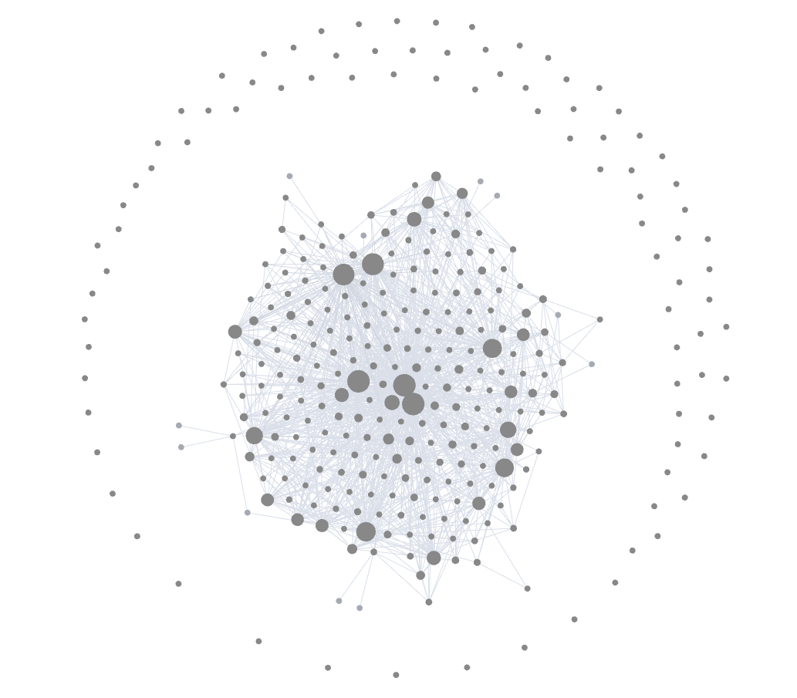
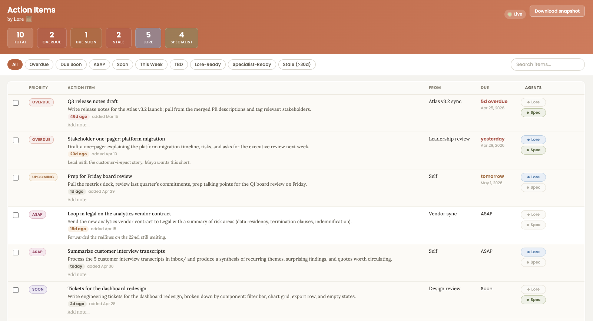

# Lore 📜

Your personal AI second brain and executive assistant. A markdown-based system that turns Claude (or any agent that supports CLAUDE.md and a folder of workflow files) into a long-running, context-aware partner for managing your role, your team, your stakeholders, and your work.

Lore stays out of your way until you need it, remembers what matters across sessions, and adapts to how you like to work.

Lore's signet is the scroll: 📜. You'll see it on the agent's signed outputs (briefs, talk tracks, weekly reviews, signed-off meeting notes). It marks work that came from Lore.

---

## Getting started

### 1. Clone the repo

Clone to `~/src/lore` (Mac/Linux) or `$HOME\src\lore` (Windows). Companion specialist agents reference this path; using a different location means you'll have to edit their instructions to match.

**Mac / Linux:**
```bash
mkdir -p ~/src
git clone https://github.com/Guaranteed-Rate/lore.git ~/src/lore
cd ~/src/lore
```

**Windows (PowerShell):**
```powershell
New-Item -ItemType Directory -Force "$HOME\src"
git clone https://github.com/Guaranteed-Rate/lore.git "$HOME\src\lore"
cd "$HOME\src\lore"
```

### 2. Open the folder in your AI agent

Lore is designed to work with agents that read a top-level `CLAUDE.md` and treat the folder as a persistent workspace. The reference setup is **Cowork** (the desktop app that ships Claude as a workspace agent) or **Claude Code** running in this directory.

Other configurations work too, Lore is just markdown files. As long as your agent can read files in the folder and edit them, it can run Lore.

### 3. Run onboarding

The first time you talk to your agent in this folder, it will detect that `context.md` is missing and run the onboarding interview automatically. The interview takes 10 to 15 minutes and walks you through:

1. Your role, title, company, and who you report to.
2. Your primary duties and current focus.
3. Your direct reports (if any), one by one.
4. Your key stakeholders.
5. Your active initiatives and current challenges.
6. The tools you use (Jira, Confluence, Slack, etc.).
7. Your working style preferences and how you'd like Lore to communicate with you (concise, warm, analytical, coach-style, executive briefing, or your own custom style).

You can pause anytime, skip phases that don't apply, and come back later by saying "run onboarding."

By the end, Lore will have generated:
- `context.md`, your master profile.
- `team/[firstname].md`, one file per direct report.
- `stakeholders/[firstname-lastname].md`, one file per stakeholder.
- A live `action-items` artifact in your Cowork sidebar (empty, ready to use). This is the canonical action items tracker; no local file is created for it.

### 4. Start using it

Once onboarding is done, try any of these:

| Task | Prompt |
|------|--------|
| See open tasks | "Show my action items" |
| Process a meeting | "Process this transcript:" then paste, or drop a file in `meetings/transcripts/` |
| Process raw notes | "I have some notes to process" then paste or upload, works for typed notes, OneNote exports, and photos of handwritten notes |
| Prep for a 1:1 | "Help me prepare for my 1:1 with [name]" |
| Start the day | "Morning sync" |
| Triage your channels | "Triage everything" or "What needs me across email, Slack, and Teams" |
| End the week | "Run my weekly review" |
| Make a decision | "Help me think through a decision about [topic]" |
| Get unblocked | "I need help with [stakeholder situation]" |

You don't need to memorize prompts. Just describe what you want, and Lore will route to the right workflow.

### Optional integrations

If you use a [Plaud](https://www.plaud.ai/) recorder, you can connect Lore to Plaud's MCP to pull transcripts directly instead of dropping files manually. Once connected, say "Sync Plaud from the last week" (or any time range) and Lore will fetch unprocessed recordings and walk you through them. Setup: [docs.plaud.ai/documentation/plaud_app/mcp](https://docs.plaud.ai/documentation/plaud_app/mcp).

If you connect **Slack** and **Microsoft 365** (Outlook and Teams), Lore can run a unified triage across all three channels. Say "triage everything" and Lore sweeps your inbox, your Slack DMs / mentions / project channels, and your Teams chats, then drafts responses grounded in your knowledge base and writing voice. It is draft-and-hold: nothing sends without you. Slack replies become native drafts in your "Drafts & Sent"; email and Teams replies are staged as paste-ready files in `outbox/drafts/` because those connectors are read-only. Multi-person Teams group chats are summarized rather than answered, and Lore asks before adding anything it learns to your knowledge base. You can also run it on a schedule (for example, twice a day). See `workflows/triage.md`.

If you use [Obsidian](https://obsidian.md/), Lore can store entity data (people, meetings, decisions, projects) directly in your vault and use Obsidian's wikilinks and backlinks to avoid duplicating context. See the **Obsidian integration** section below.

---

## Obsidian integration

Lore detects at session start whether the [Obsidian MCP](https://github.com/cyanheads/obsidian-mcp-server) is connected. If it is, Lore operates in **Obsidian mode**: the vault becomes the canonical store for entity data, and the agent uses wikilinks, backlinks, frontmatter, and Obsidian search instead of folder paths and grep. If the MCP isn't connected, Lore operates in **Filesystem mode**, which is the original behavior described in the rest of this README, unchanged.

As your vault fills with people, meetings, decisions, and projects, Obsidian's graph view turns it into an explorable knowledge graph. Each node is an entity and each edge is a wikilink, so you can see at a glance how teammates, initiatives, and decisions connect:



*An example of an Obsidian linked knowledge graph*

### What this gives you

- **Each fact lives in exactly one place.** A teammate's role lives on their note in `Lore/People/`. Meeting notes wikilink to the person rather than restating role. Obsidian's backlinks pane on the person's note shows every meeting, decision, and observation involving them, without any duplication.
- **Native graph view.** People, projects, decisions, and meetings become nodes you can explore visually.
- **Periodic notes for daily and weekly reviews** use Obsidian's periodic-note machinery (`obsidian_get_note`), so they show up in the calendar pane and integrate with your existing Obsidian workflow.
- **Surgical updates.** Lore uses `obsidian_patch_note` to append observations under named headings instead of rewriting whole files. Safer for concurrent edits while you have the vault open.

### Where Lore stores things in the vault

Lore operates from a dedicated `Lore/` subfolder inside your vault so it doesn't collide with your existing notes (the subfolder name is configurable in `context.md` under "Notes for Lore" → "Vault Configuration", which is useful if you maintain multiple Lore instances per org, e.g., `Lore - Acme/`, `Lore - Personal/`):

```
<your-vault>/
└── Lore/
    ├── People/         One note per person (direct reports, peers, stakeholders)
    ├── Meetings/       One note per meeting; wikilinks to People and Projects
    ├── Transcripts/    Raw transcripts (Plaud, pasted, etc.)
    ├── Decisions/      One note per decision; wikilinks to People and Projects
    ├── Projects/       One note per project or initiative
    ├── Inbox/          Notes pending processing; tagged #inbox/unprocessed
    ├── Daily/          Periodic daily notes
    └── Weekly/         Periodic weekly notes
```

If you want a different subfolder name, record it in `context.md` under "Notes for Lore" and Lore will use that instead.

### What stays in the repo

The `lore/` repo still holds the agent logic (`CLAUDE.md`, `workflows/`, `templates/`, `playbooks/`), the action-items artifact build script, and the action-items snapshot file. Personal entity data (people, meetings, decisions, observations) moves into the vault. Operational tracking files (`.processed`, `.plaud-processed`, `.email-processed`) also stay in the repo because Obsidian ignores dotfiles.

The action-items artifact is unchanged in Obsidian mode. The artifact's IndexedDB remains the sole source of truth for action items.

### Setup

1. Install the [Local REST API community plugin](https://github.com/coddingtonbear/obsidian-local-rest-api) in Obsidian. In the plugin settings, enable **"Encrypted (HTTPS) Server"** and generate an API key.

2. Add the MCP server to your Cowork or Claude Code config:

   ```json
   "mcpServers": {
     "obsidian": {
       "type": "stdio",
       "command": "npx",
       "args": ["-y", "obsidian-mcp-server@latest"],
       "env": {
         "MCP_TRANSPORT_TYPE": "stdio",
         "MCP_LOG_LEVEL": "info",
         "OBSIDIAN_API_KEY": "[YOUR API KEY]",
         "OBSIDIAN_BASE_URL": "https://127.0.0.1:27124"
       }
     }
   }
   ```

   The `OBSIDIAN_BASE_URL` points to the plugin's always-on HTTPS port. The server handles the self-signed certificate automatically (`OBSIDIAN_VERIFY_SSL` defaults to `false`).

3. Open Cowork in your `lore/` folder. Lore will detect the MCP, announce "Obsidian mode active," and start using the vault for new entity data.

### Migration of existing filesystem data

If you have existing files in `team/`, `stakeholders/`, `decisions/log.md`, or `meetings/notes/` from filesystem mode, they stay where they are. They aren't auto-migrated. New data lands in the vault under `Lore/`. If you want a one-shot migration of existing data into the vault, ask Lore: *"Migrate my existing Lore data into the vault."* Lore will preview the changes before writing.

### Workflow coverage

Workflows opt into Obsidian mode incrementally. As of this writing, `process-transcript`, `plaud-sync`, and `triage` use the vault when it's connected. Other workflows continue to operate against the filesystem until they're migrated. `CLAUDE.md` and each workflow file note which mode they support; see `OBSIDIAN_PLAN.md` for the rollout plan.

---

## What's in the box

```
lore/
├── CLAUDE.md           ← Agent orientation. Tells Lore how to behave.
├── README.md           ← You are here.
│
├── context.md          ← Your master profile (generated by onboarding; gitignored).
│
├── templates/          ← Canonical file templates Lore uses for new files.
├── workflows/          ← Workflow definitions (onboarding, action items, transcripts, etc.).
├── playbooks/          ← Frameworks (stakeholder management, difficult conversations, feedback, etc.).
├── scripts/            ← Helper scripts (e.g., the action items artifact builder).
│
├── inbox/              ← Action items + drop zone for documents to process.
├── outbox/             ← Generated outputs (reports, exports, prep docs).
│
├── team/               ← Profiles of your direct reports.
├── stakeholders/       ← Profiles of people you work with regularly.
│
├── meetings/
│   ├── notes/          ← Structured meeting summaries.
│   ├── transcripts/    ← Raw transcripts (drop them here for processing).
│   └── templates/      ← Pre-meeting prep templates (1:1, decision meeting, etc.).
│
├── decisions/log.md    ← Decision log.
├── weekly-reviews/     ← Weekly review entries.
└── strategy/           ← Your strategy docs (vision, roadmap, etc.).
```

Personal files (everything in `inbox/`, `outbox/`, `team/`, `stakeholders/`, `meetings/notes/`, `meetings/transcripts/`, `weekly-reviews/`, `decisions/log.md`, `strategy/*.md`, and `context.md`) are gitignored. The repo only commits the agent logic and templates.

---

## Action items

Lore's most-used surface is its action items tracker. It's the front door for *"what should I work on,"* the backbone of meeting follow-through, and the routing layer for delegating work to Lore itself or to a sibling specialist agent.


*This is a mock screenshot showing Lore's action items app.*

The artifact is styled to Anthropic's design system, warm terra-cotta on Pampas with Poppins for chrome and Lora for body text, so it feels at home when opened inside the Claude Cowork desktop app rather than reading as a foreign widget pinned to the sidebar.

The tracker is **the live artifact**, a rich, interactive view in Cowork's sidebar (pictured above). IndexedDB-backed, instant edits, no server. The artifact's IndexedDB is the sole source of truth.

Lore (and any sibling specialist agent) updates the artifact by pushing **delta operations** (add / complete / delegate / reopen / archive / update). The agent never replaces the artifact's state wholesale, so edits you make directly in the artifact are preserved across agent pushes.

A **restore-only markdown backup** is available via the artifact's Download snapshot button. That backup file is never read by the agent as a source of truth; it exists for the rare case where you need to restore the artifact from scratch (deletion, IDB wipe), which you do via the artifact's Restore from backup button.

If you run Lore in **Claude Code** or another environment without the Cowork artifact, the agent can't push to the artifact and the action items workflow is unavailable in that environment. Use Cowork for live action item tracking.

### What the artifact gives you

- **Priority-sorted rows** with badges for Overdue, Due Soon, ASAP, Soon, This Week, and TBD.
- **Two delegation flags per row**, each independently toggleable:
  - **Lore** (blue chip) for items Lore can do from inside the workspace.
  - **Specialist** (green chip) for items a sibling specialist agent (e.g., Sigil) can pick up autonomously off-session.
- **Age tracking.** Each row shows when it was added (e.g. *"92d ago · added Jan 29"*). A **Stale (>30d)** filter pill surfaces items aging in your backlog as candidates for archiving or follow-up.
- **Inline editing.** Click any cell to rename, change due dates via a date popover, edit notes, toggle flags, mark complete with a checkbox confirmation, or archive a row.
- **Quick-add at the bottom** for fast capture, with both delegation toggles built in so new items get classified the moment they're created.
- **Search and stats** across the top: live counts for Total, Overdue, Due Soon, Stale, Lore-Ready, and Specialist-Ready.
- **Download snapshot** exports a markdown copy of the current state. Use it for restore (if the artifact ever gets wiped) or to give Lore a current view (see "Sharing state with Lore" below).
- **Restore from backup** lets you re-seed the artifact from a previously downloaded snapshot, useful if the artifact was deleted or IDB was wiped.

### How the artifact stays canonical

The artifact's IndexedDB is the sole source of truth. Edits you make in the artifact (mark complete, change due date, add or delegate items, etc.) persist locally and are never overwritten by the agent.

When you ask Lore to do something that changes action items (process a transcript, add an item by request, mark something complete), Lore builds a JSON `operations` array, runs `scripts/build-action-items-artifact.js`, and pushes the resulting HTML via `mcp__cowork__update_artifact`. The artifact's bootstrap detects the new `seedVersion`, applies the operations as a delta on top of its IDB, and that's that. Your direct edits aren't touched.

You don't need to click anything to keep the agent and artifact in sync. There is no sync. The artifact is canonical; the agent only ever submits change requests.

### Sharing state with Lore (the snapshot ritual)

Lore has no direct read access to the artifact's IndexedDB. Cowork's webview sandbox blocks artifact code from writing files automatically, so there's no live mirror. Instead, when you want Lore to know what's currently on your plate (for dedup, 1:1 prep, roundtable prep, morning sync, or just "what should I work on"), use this one-step ritual:

1. **Click Download snapshot** in the artifact. A markdown file named `action-items.snapshot.md` lands in your Downloads folder.
2. **Drag it into your Lore workspace** at `inbox/action-items.snapshot.md` (the agent looks there by convention).

Lore reads that file when it needs a view of state. The file is a point-in-time snapshot: as fresh as the moment you clicked Download. If you want Lore to know about more recent changes (you just completed three items in the artifact, then asked Lore for a roundtable prep), download a fresh snapshot first. If the file is stale or missing, Lore tells you and asks for a fresh one.

You can also paste the snapshot content directly in chat instead of saving the file. Lore will use whichever it has access to.

> Why is this manual? Cowork's webview policy currently blocks programmatic file writes from artifact code. If a future Cowork build enables it, the artifact has plumbing for an "Enable auto-backup" button that would make this automatic. Until then, the manual ritual is the cleanest path that respects the sandbox.

### The two delegation flags in practice

Each Active row has two booleans that say "who could do this":

- **Lore = `Y`**, Lore can do or substantially advance this item from inside the workspace, in chat. Drafting docs, summarizing threads, generating prep briefs, querying connectors, building small artifacts.
- **Specialist = `Y`**, A sibling specialist agent can pick this up autonomously, off-session. Writing Jira tickets, drafting PRDs, scoping engineering work, generating release notes, pulling structured data from production systems.

The flags are independent. Both can be `Y` (either could do it), or both blank (you do it yourself), or one of each. When Lore adds an item, it sets these flags reflectively: "Could I do this? Could the specialist?" When you flag an item `Specialist: Y` and run your specialist, it scans for those rows, does the work, and writes the row directly into the Completed table. Lore picks up the change on its next run and reflects it in the live artifact.

See `workflows/action-items.md` for the full delegation contract, and the **Companion specialist agents** section below for how to wire one up.

---

## How this system works

1. **`context.md`**, Lore reads this to understand your role, company, team, priorities, and preferred communication style. Update it regularly.

2. **Team and stakeholder profiles**, Living documents that grow over time. Lore updates them automatically when processing meeting transcripts. You can also edit them directly.

3. **Decision log**, Captures key decisions with context, options considered, and rationale. Helps you revisit past choices and see patterns.

4. **Weekly reviews**, Structured reflection to maintain visibility and catch issues early.

5. **Workflows**, Each common task has a workflow file in `workflows/`. Lore reads the relevant one and follows its instructions when you ask.

---

## Recommended rituals

| Cadence | Ritual |
|---------|--------|
| Daily | Quick scan of the action items artifact (Cowork sidebar); flag blockers or decisions needed. |
| Weekly (Monday) | Run weekly planning session. |
| Weekly (Friday) | Run weekly review; prep for any roundtable / leadership meeting. |
| Before 1:1s | Prep with Lore using the team member's profile. |
| After meetings | Drop the transcript in `meetings/transcripts/`; let Lore extract action items, decisions, and observations. |
| After taking notes | Say "I have some notes to process" and paste or upload your notes, Lore will ask a few quick questions and file everything in the right place. |
| Monthly | Update `context.md` priorities, review team development goals, update strategy docs. |
| Quarterly | Full strategy review, team performance conversations, OKR/goal setting. |

---

## Tips for working with Lore

1. **Be specific.** "[Direct report] is struggling with stakeholder X" beats "team issue."
2. **Share context.** The more Lore knows, the better the advice. Drop relevant docs in `inbox/documents/` and ask Lore to ingest them.
3. **Challenge back.** Ask "what am I missing?" or "play devil's advocate" when you want pushback.
4. **Keep `context.md` current.** Priorities, stakeholders, and active initiatives shift. A fresh `context.md` makes everything downstream sharper.
5. **Edit anything.** Lore writes plain markdown. If a generated file is wrong, fix it directly. Lore will pick up your edits next time.

---

## Privacy and data

Lore is local-first. All files live on your machine. Nothing is uploaded to a server unless you explicitly ask Lore to use a connector (Jira, Slack, etc.). The `.gitignore` excludes all your personal data, so even if you push the repo to GitHub, only the agent logic and templates ship.

---

## Customizing Lore

You can edit:
- `CLAUDE.md` to change Lore's core behavior.
- `workflows/*.md` to change how specific tasks work.
- `templates/*.md` to change the format of generated files.
- `playbooks/*.md` to change the frameworks Lore reaches for.
- `context.md` to change anything about you or how Lore should talk to you.

If you want a different tone or a different workflow, just edit the file. Lore reads the files fresh each session.

---

## Companion specialist agents

Lore is designed to work with sibling specialist agents that handle role-specific execution. The pattern is: Lore is the generalist context layer, specialists are the executors that read from Lore and act.

The action items artifact doubles as a delegation bus. Each Active row carries two independent boolean flags that say who could plausibly do the work:

- **Lore (`Y`)**, Lore can do the item from inside this workspace, in chat. Examples: drafting documents, summarizing threads, generating prep briefs, querying connectors, building small artifacts.
- **Specialist (`Y`)**, a sibling specialist agent can pick the item up autonomously, off-session. Examples: writing Jira tickets, drafting PRDs, scoping engineering work, generating release notes, pulling structured data.

Both flags can be `Y` on the same row. Both can be blank (the user does it themselves). The specialist learns about `Specialist: Y` items by asking the user to share a Downloaded snapshot, then pushes its own `complete` operations to the artifact when work is done (using the same `scripts/build-action-items-artifact.js` + `mcp__cowork__update_artifact` path Lore uses). See `workflows/action-items.md` for the full delegation contract.

A reference example: the RINS Product team uses a specialist agent called **Sigil** for product-engineering tasks. Sigil reads Lore's `context.md`, `team/`, `stakeholders/` for context, asks the user for a Downloaded snapshot to identify `Specialist: Y` items, and pushes operations back to the artifact when work completes. Lore knows about Sigil as a delegation target; Sigil knows about Lore as a context source. Neither requires the other to function.

If you have a specialist agent of your own (call it whatever you want), the integration is just shared filesystem reads. Point it at your Lore folder (`~/src/lore` on Mac/Linux, `$HOME\src\lore` on Windows) and tell it the convention. The specialist needs no special integration plumbing, just instructions, which can include a graceful "if Lore isn't installed for this user, ignore" check so the specialist works for teammates who don't run Lore.

### Wiring up a specialist: the integration prompt

Below is the prompt the RINS Product team uses to brief Sigil on Lore. Copy the relevant block into your specialist's `CLAUDE.md` (or paste the one-shot prompt at the start of a session). It's designed to **degrade gracefully**: if Lore isn't installed on a teammate's machine, the specialist silently skips the integration and operates normally.

The example uses the name **Sigil**; substitute your specialist's name if it differs.

#### One-shot prompt (for a single session)

> You may optionally have access to a sibling agent named **Lore**, which is a generalist personal-assistant / second-brain agent that some users run alongside you. Lore tracks the user's role, team, stakeholders, action items, decisions, and meeting notes.
>
> **First check whether Lore is present.** Lore lives at `~/src/lore` on Mac/Linux or `$HOME\src\lore` on Windows (e.g. `C:\Users\username\src\lore`). Use whichever matches the user's OS. Try reading `LORE_PATH/CLAUDE.md` and `LORE_PATH/context.md` using your file tools.
> - If both files are readable, the user has Lore installed. Use the integration described below.
> - If either is missing, the user does **not** have Lore. Ignore everything below this line and operate normally. Do not mention Lore to the user.
>
> **Files you can read for context** (paths relative to `LORE_PATH`):
> - `context.md`, role, team, current priorities, active initiatives, key stakeholders, tools.
> - `team/*.md`, direct report profiles.
> - `stakeholders/*.md`, stakeholder profiles.
> - `decisions/log.md`, past decisions with context and rationale.
> - `meetings/notes/*.md`, structured meeting summaries.
>
> **Action items live in a live Cowork artifact (id: `action-items`), not in any local file.** The artifact's IndexedDB is the sole source of truth. Do NOT read `inbox/action-items.md`; if it exists at all it's a restore-only backup that may be stale. To see what's in the artifact, ask the user to click Download snapshot in the artifact and share the resulting markdown file with you.
>
> **The two delegation flags.** Each Active row in the artifact has two independent booleans:
> - **Lore** is `Y` if Lore could plausibly do the item from inside its workspace (drafting docs, summarizing threads, building small artifacts, querying connectors).
> - **Specialist** is `Y` if a specialist agent (you) could pick it up autonomously.
>
> **You only act on items where `Specialist: Y`.** When proposing work, prefer those rows. Ignore the `Lore` flag for your own scoping; it tells the user (and Lore) what Lore could do, not what you should do. If a row is flagged `Specialist: Y` AND `Lore: Y`, either of you could handle it, whoever is in front of the user wins.
>
> **When you complete an item from Lore's action items list:**
> 1. Do the work.
> 2. Push a `complete` operation to the action items artifact:
>    - Build a JSON file with `[{"op":"complete","subject":"<exact subject>","from":"<exact from>","resolution":"<one-line description>"}]`
>    - Run `node LORE_PATH/scripts/build-action-items-artifact.js <ops.json>`
>    - Call `mcp__cowork__update_artifact(id="action-items", html_path="LORE_PATH/outbox/action-items-artifact-built.html", mcp_tools=[], update_summary="Completed: <subject>")`
> 3. Subject and From must match the values in the artifact exactly (normalized: trimmed + lowercased) or the op will silently no-op.
> 4. Tell the user that you marked the item complete.
>
> **When you start trackable work that ISN'T from a flagged item.** Ask the user *"Want me to log this in Lore's action items?"* If yes, push an `add` operation using the same procedure. The `add` op shape:
> ```json
> {
>   "op": "add",
>   "item": {
>     "date": "YYYY-MM-DD",
>     "created": "YYYY-MM-DD (today)",
>     "from": "Sigil" or the originating context,
>     "subject": "short title",
>     "actionNeeded": "full description",
>     "due": "TBD" or specific value,
>     "lore": "Y" or "",
>     "specialist": "Y" (since you're doing it),
>     "notes": ""
>   }
> }
> ```
> Never write to `inbox/action-items.md`. The artifact handles dedup automatically on `subject + from`.
>
> **Don't try to be Lore.** If the user asks for things outside your specialist scope (process a meeting transcript, prep for a 1:1, write a stakeholder talk track, do a weekly review), tell them: *"That's a Lore task, open Cowork and work in your Lore folder."* Lore items are flagged `Lore: Y`, which is also a hint that the work belongs over there even if you could in principle do it.

#### Persistent addition to your specialist's `CLAUDE.md`

Add a section like this to your specialist's `CLAUDE.md` so the awareness persists across sessions, including for teammates who don't have Lore installed:

````markdown
---

## Optional sibling agent: Lore

Some users run a generalist personal-assistant agent named **Lore** alongside this one. Lore lives at `~/src/lore` on Mac/Linux or `$HOME\src\lore` on Windows. Lore tracks the user's role, team, stakeholders, action items, decisions, and meeting notes. If a user has Lore installed, you can read from it for richer context and consume action items Lore has flagged for specialist agents.

**Detect at session start.** Lore lives at `~/src/lore` (Mac/Linux) or `$HOME\src\lore` (Windows). Try reading `LORE_PATH/CLAUDE.md` and `LORE_PATH/context.md` using your file tools.
- Both files readable → Lore is installed; use the integration below.
- Either missing → Lore is not installed for this user. **Ignore the rest of this section.** Do not mention Lore.

### If Lore is present

**Files you may read for context** (paths relative to `LORE_PATH`):
- `context.md`, role, team, priorities, tools.
- `team/*.md`, direct report profiles.
- `stakeholders/*.md`, stakeholder profiles.
- `decisions/log.md`, decision history.
- `meetings/notes/*.md`, meeting summaries.

**Action items live in a Cowork artifact, NOT a local file.** Lore's action items are tracked in a live Cowork artifact with id `action-items`. The artifact's IndexedDB is the sole source of truth. Do NOT read `inbox/action-items.md` (it may exist as a stale backup but is never authoritative). To see what's currently in the artifact, ask the user to click Download snapshot in the artifact and share the resulting markdown file.

Each Active row has two independent delegation booleans:
- **Lore = `Y`**: Lore can plausibly do it from inside its workspace (docs, summaries, prep briefs, connector queries, small artifacts).
- **Specialist = `Y`**: a specialist agent (you) can pick it up autonomously.

You only act on `Specialist: Y` items. When the user asks "what should I work on" or you're picking work to take on, prefer those. The `Lore` flag is informational for you; rows flagged `Lore: Y` belong with Lore even if you could in principle do them.

**Completing an item from Lore.** When you finish work that came from a `Specialist: Y` row:
1. Do the work.
2. Push a `complete` operation to the artifact:
   - Build `ops.json` with `[{"op":"complete","subject":"<exact subject>","from":"<exact from>","resolution":"<one-line description>"}]`
   - `node LORE_PATH/scripts/build-action-items-artifact.js ops.json`
   - `mcp__cowork__update_artifact(id="action-items", html_path="LORE_PATH/outbox/action-items-artifact-built.html", mcp_tools=[], update_summary="Completed: <subject>")`
3. Subject and From must match the artifact's values exactly (matching normalizes by trim + lowercase). Tell the user that you marked the item complete.
4. Do NOT write to `inbox/action-items.md`.

**Adding a new trackable item.** If you start work the user wants tracked, ask them whether to log it in Lore. If yes, push an `add` operation using the same procedure:
```json
[{"op":"add","item":{"date":"YYYY-MM-DD","created":"YYYY-MM-DD","from":"Sigil","subject":"...","actionNeeded":"...","due":"TBD","lore":"","specialist":"Y","notes":""}}]
```
The artifact dedupes adds on `subject + from`, so re-pushing the same add is harmless.

**Scope boundary.** Lore handles general executive-assistant work (transcripts, 1:1 prep, talk tracks, weekly reviews, stakeholder management). When users ask you for those, redirect them to Lore: *"That's a Lore task, open Cowork and work in your Lore folder."*

### If Lore is not present

Operate normally. Don't mention Lore. Don't try to read or write the Lore folder.
````

---

## Contributing

Issues, ideas, and pull requests are welcome.

A few things worth flagging if you want to contribute:

- **Keep the template generic.** Anything user-specific (a particular team member's name, a particular Jira project key, a specific company) belongs in the gitignored personal files (`context.md`, `team/`, `stakeholders/`, etc.), not in the committed agent logic. The audit hooks in `CLAUDE.md` list which folders are personal.
- **Workflows are the extension point.** Most new behavior should land as a new file in `workflows/` (and a corresponding row in `CLAUDE.md`'s workflow table) rather than as new top-level logic. Playbooks are similar: drop in a new framework as a markdown file in `playbooks/` and Lore can reach for it without code changes.
- **Templates evolve carefully.** Editing a file in `templates/` changes the format for all future generated files, but doesn't retroactively update existing ones. Test changes against your own data before submitting.
- **No personal data in commits.** The `.gitignore` is aggressive but not infallible. Run a quick grep for names / company specifics on `git diff --cached` before committing.

## Questions or interest in adopting Lore

Reach out to Colton Marshall

---

## A note on the name

Lore is a body of knowledge passed down, accumulated context that makes the people who hold it more effective at what they do. That's what this system is: a place for the lore of your role to accumulate and stay accessible, instead of living in your head and your notebooks and your Slack history.

The scroll signet (📜) is on signed outputs because Lore writes documents the way a scribe might, and a scribe seals their work.
